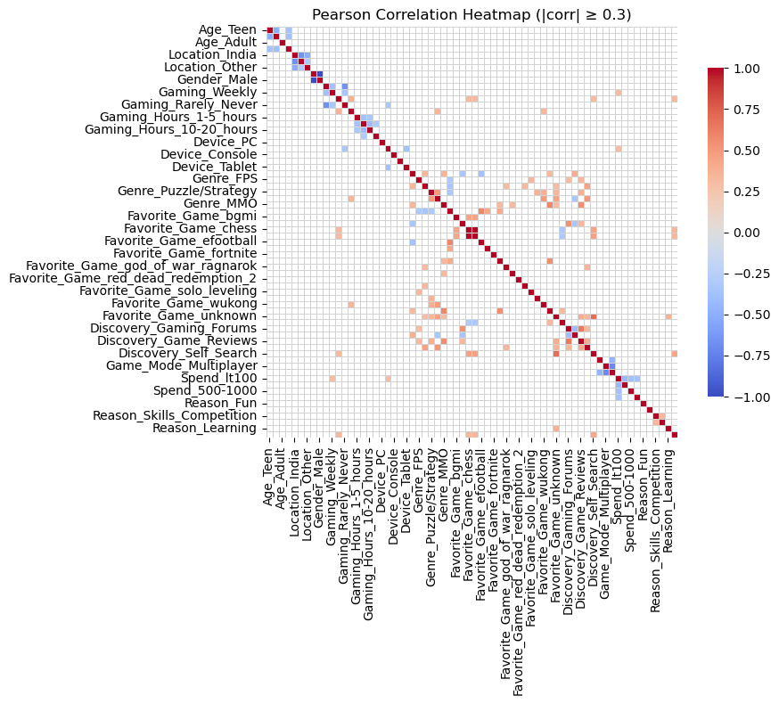
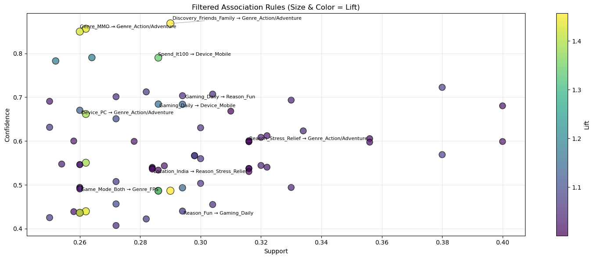
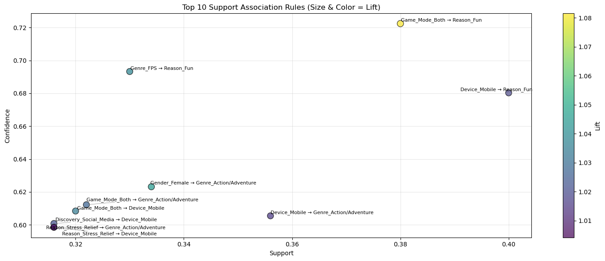
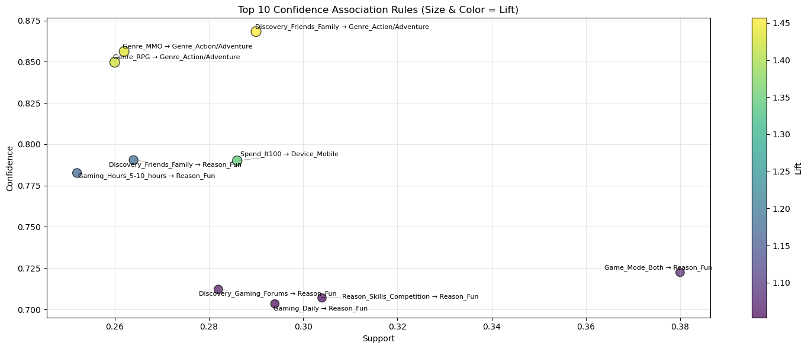
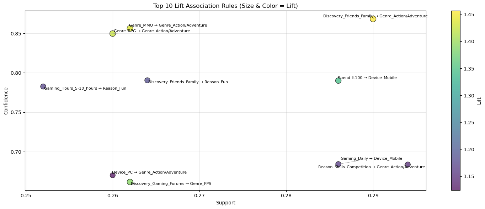
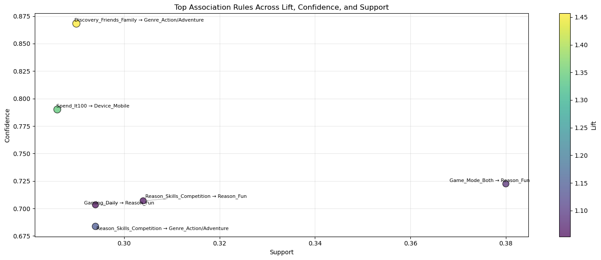

# Association Rule Mining of Gaming Preferences and Habits using the Apriori Algorithm
**CSC172 Data Mining and Analysis Final Project**  
*Mindanao State University - Iligan Institute of Technology*  
**Student:** Josiah Raziel S. Lluch, 2022-0834  
**Semester:** AY 2025-2026 Sem 1

  

## Abstract
This project applies association rule mining with the Apriori algorithm to a gaming survey dataset to uncover patterns in players’ preferences and habits. Each respondent’s answers (e.g., preferred genres, platforms, playstyle, location, time spent gaming, and spending behavior) are transformed into a set of binary items and analyzed as a transaction. Using Apriori, the project extracts frequent itemsets and high-quality association rules evaluated by support, confidence, and lift to reveal which combinations of characteristics tend to co‑occur among gamers. The results highlight interpretable player “personas” and preference bundles that can inform game design, content recommendations, and targeted marketing strategies.

## Table of Contents
- [Abstract](#abstract)
- [1. Introduction](#1-introduction)
  - [1.1 Problem Statement](#11-problem-statement)
  - [1.2 Objectives](#12-objectives)
  - [1.3 Scope and Limitations](#13-scope-and-limitations)
- [2. Dataset Description](#2-dataset-description)
  - [2.1 Source and Acquisition](#21-source-and-acquisition)
  - [2.2 Data Structure](#22-data-structure)
  - [2.3 Sample Transactions](#23-sample-transactions)
- [3. Methodology](#3-methodology)
  - [3.1 Data Preprocessing](#31-data-preprocessing)
  - [3.2 Exploratory Data Analysis](#32-exploratory-data-analysis)
  - [3.3 Apriori Algorithm Implementation](#33-apriori-algorithm-implementation)
  - [3.4 Evaluation Metrics](#34-evaluation-metrics)
- [4. Results](#4-results)
  - [4.1 Top Association Rules](#41-top-association-rules)
  - [4.2 Key Visualizations](#42-key-visualizations)
  - [4.3 Performance Metrics](#43-performance-metrics)
- [5. Discussion](#5-discussion)
  - [5.1 Business Insights](#51-business-insights)
  - [5.2 Actionable Recommendations](#52-actionable-recommendations)
  - [5.3 Limitations](#53-limitations)
- [6. Conclusion](#6-conclusion)
- [7. Video Presentation](#7-video-presentation)
- [References](#references)
- [Appendix: Full Results](#appendix-full-results)

## 1. Introduction
### 1.1 Problem Statement
Game developers and platform owners need to understand which combinations of player characteristics, gaming habits, and preferences tend to occur together so they can design better features, target content, and tailor monetization strategies. However, survey data on gamers is high‑dimensional and contains many categorical responses (e.g., preferred genres, platforms, play styles, spending and time‑investment patterns), making it difficult to manually detect consistent preference bundles or player segments across hundreds of respondents. This project applies association rule mining with the Apriori algorithm to a gaming survey dataset to discover frequent itemsets and strong rules that reveal meaningful patterns in players’ demographics, game preferences, and play behaviors.

### 1.2 Objectives
- Preprocess the gaming survey dataset by cleaning responses, handling missing values, and converting all relevant features (e.g., preferred genres, platforms, competitive/casual style, spending habits, and binned playtime/hours‑per‑week) into categorical variables suitable for association rule mining.
- Transform the preprocessed data into a transaction format (one‑hot encoded items per respondent) that can be used as input to the Apriori algorithm.​
- Implement the Apriori algorithm (via mlxtend) to generate frequent itemsets and association rules that describe co‑occurring preferences and behaviors among gamers.​
- Evaluate and filter the discovered rules using support, confidence, lift to retain only statistically meaningful and interpretable patterns.​
- Interpret and visualize key rules to highlight distinct player segments (e.g., high‑playtime competitive players, casual mobile players, multi‑genre enthusiasts) and discuss potential implications for game design and marketing.

### 1.3 Scope and Limitations
**Scope:** 
- Analyze one cleaned gaming survey dataset where each respondent is modeled as a transaction composed of binary items representing demographics, platforms, genres, playstyle, time spent gaming, and spending patterns.
- Apply association rule mining using the Apriori algorithm to generate frequent itemsets and association rules that describe co‑occurring player characteristics and habits.​
- Evaluate rules with standard metrics (support, confidence, lift) and present a curated subset of interpretable rules as gamer “personas” and preference bundles. 

**Limitations:** 
- Results are limited to the sampled population of the survey and may not generalize to all gamers (other regions, age groups, or platforms).​
- All continuous information has been discretized into bins and one‑hot encoded, so subtle numeric differences within the same bin are not modeled.​
- Apriori only captures co‑occurrence, not causality; discovered rules indicate associations, not reasons why players behave a certain way.​
- The number and quality of rules depend on chosen thresholds (support, confidence, lift) and on filtering rare items; some potentially interesting but infrequent patterns may be excluded.

## 2. Dataset Description
### 2.1 Source and Acquisition
**Source:** [Gaming Preferences and Habits: Player Survey 2024 - Kaggle](https://www.kaggle.com/datasets/pranshudev/gaming-preferences-and-habits-player-survey-2024)  
**Size:** 500 transactions, 66 unique items  
**Format:** Respondent ID + full set of survey answers → transaction of binary items (one row per player in basket format).

### 2.2 Data Structure

Raw format (one row per item):

`'Age_Teen'`, `'Age_Young_Adult'`, `'Age_Adult'`, `'Age_Mid_Adult'`, `'Location_India'`, `'Location_US'`, `'Location_Other'`, `'Gender_Female'`, `'Gender_Male'`, `'Gaming_Daily'`, `'Gaming_Weekly'`, `'Gaming_Monthly'`, `'Gaming_Rarely_Never'`, `'Gaming_Hours_0-1_hour'`, `'Gaming_Hours_1-5_hours'`, `'Gaming_Hours_5-10_hours'`, `'Gaming_Hours_10-20_hours'`, `'Gaming_Hours_20plus_hours'`, `'Device_PC'`, `'Device_Mobile'`, `'Device_Console'`, `'Device_Handheld'`, `'Device_Tablet'`, `'Genre_Action/Adventure'`, `'Genre_FPS'`, `'Genre_RPG'`, `'Genre_Puzzle/Strategy'`, `'Genre_Simulation'`, `'Genre_MMO'`, `'Genre_Sports'`, `'Favorite_Game_bgmi'`, `'Favorite_Game_call_of_duty'`, `'Favorite_Game_chess'`, `'Favorite_Game_clash_of_clans'`, `'Favorite_Game_efootball'`, `'Favorite_Game_fc_mobile'`, `'Favorite_Game_fortnite'`, `'Favorite_Game_free_fire'`, `'Favorite_Game_god_of_war_ragnarok'`, `'Favorite_Game_moba_legends'`, `'Favorite_Game_red_dead_redemption_2'`, `'Favorite_Game_rhythm_rush_lite'`, `'Favorite_Game_solo_leveling'`, `'Favorite_Game_subway'`, `'Favorite_Game_wukong'`, `'Favorite_Game_wuthering_waves'`, `'Favorite_Game_unknown'`, `'Discovery_Social_Media'`, `'Discovery_Gaming_Forums'`, `'Discovery_Friends_Family'`, `'Discovery_Game_Reviews'`, `'Discovery_YouTube_Streaming'`, `'Discovery_Self_Search'`, `'Game_Mode_Single_Player'`, `'Game_Mode_Multiplayer'`, `'Game_Mode_Both'`, `'Spend_lt100'`, `'Spend_100-500'`, `'Spend_500-1000'`, `'Spend_1000plus'`, `'Reason_Fun'`, `'Reason_Stress_Relief'`, `'Reason_Skills_Competition'`, `'Reason_Socialize'`, `'Reason_Learning'`, `'Reason_Other'`

First three rows:

- `1 0 0 0 1 0 0 0 1 1 0 0 0 0 0 0 1 0 0 1 0 0 0 0 0 0 0 0 0 1 0 0 0 0 0 1 0 0 0 0 0 0 0 0 0 0 0 1 1 0 0 0 0 0 0 1 1 0 0 0 1 1 0 0 0 0`

- `0 1 0 0 1 0 0 0 1 0 0 0 1 1 0 0 0 0 0 1 0 0 0 0 0 0 1 1 0 0 0 0 0 0 0 0 0 0 0 0 0 0 0 0 1 0 0 1 0 0 0 0 0 1 0 0 1 0 0 0 0 0 1 0 0 0`

- `0 1 0 0 1 0 0 0 1 0 0 0 1 0 0 0 0 1 0 0 1 0 0 0 1 0 0 0 0 0 0 1 0 0 0 0 0 0 0 0 0 0 0 0 0 0 0 0 1 0 0 0 0 0 1 0 0 1 0 0 1 0 0 0 0 0`

Transaction format (one row per basket):

  - `['Age_YoungAdult', 'Location_India', 'Genre_FPS', 'Genre_MOBA', 'Platform_PC', 'Platform_Mobile', 'Playtime_High']`,

  - `['Age_Teen', 'Location_USA', 'Genre_MOBA', 'Genre_RPG', 'Platform_Console', 'SpendsMoney_Yes']`

### 2.3 Sample Transactions
Transaction 1: 
- Length: 14
- Items:

  `['Age_Young_Adult', 'Location_India', 'Gender_Male', 'Gaming_Weekly', 'Gaming_Hours_1-5_hours', 'Device_Mobile', 'Genre_Sports', 'Favorite_Game_efootball', 'Discovery_Social_Media', 'Game_Mode_Both', 'Spend_lt100', 'Reason_Fun']`

Transaction 5: 
- Length: 18
- Items:

  `['Age_Teen', 'Location_India', 'Gender_Female', 'Gaming_Daily', 'Gaming_Hours_1-5_hours', 'Device_PC', 'Device_Mobile', 'Genre_Action/Adventure', 'Genre_FPS', 'Genre_RPG', 'Favorite_Game_solo_leveling', 'Discovery_Friends_Family', 'Game_Mode_Multiplayer', 'Spend_lt100', 'Reason_Fun', 'Reason_Stress_Relief', 'Reason_Skills_Competition', 'Reason_Socialize']`

Transaction 500: 
- Length: 16
- Items:

  `['Age_Young_Adult', 'Location_Other', 'Gender_Female', 'Gaming_Daily', 'Gaming_Hours_10-20_hours', 'Device_Console', 'Genre_FPS', 'Genre_RPG', 'Genre_Simulation', 'Favorite_Game_call_of_duty', 'Discovery_Gaming_Forums', 'Discovery_YouTube_Streaming', 'Game_Mode_Multiplayer', 'Spend_lt100', 'Reason_Stress_Relief', 'Reason_Socialize']`

## 3. Methodology

### 3.1 Data Preprocessing
1. **Duplicate Row Handling:** 
    
    No duplicate rows were found
2. **Missing Value Handling:** 

    Some columns had duplicates, specifically the latter columns like "What is your favorite game", "What genres of video games do you play? (Check all that apply)", "Which device do you play games on the most?(Check all that apply)", etc.., These said columns often had missing values in its duplicate column, or had different values from the original column. Since the original columns(first occurrence of the column) had complete data, these original columns were kept, and the duplicate columns and their data(mostly missing or inconsistent) were dropped.
3. **One-Hot Encoding:** 

    Converted categorical columns into binary columns suitable for association mining:

    - "Gender" : [`'Gender_Male'`, `'Gender_Female'`],
    - "Age" : [`'Age_Teen'`, `'Age_Young_Adult'`, `'Age_Adult'`, `'Age_Mid_Adult'`],
    - "Location" : [`'Location_India'`, `'Location_US'`, `'Location_Other'`],
    - "Frequency" : [`'Gaming_Daily'`, `'Gaming_Weekly'`, `'Gaming_Monthly'`, `'Gaming_Rarely_Never'`],
    - "Hours" : [`'Gaming_Hours_0-1_hour'`, `'Gaming_Hours_1-5_hours'`, `'Gaming_Hours_5-10_hours'`, `'Gaming_Hours_10-20_hours'`, `'Gaming_Hours_20plus_hours'`],
    - "Device" : [`'Device_PC'`, `'Device_Mobile'`, `'Device_Console'`, `'Device_Handheld'`, `'Device_Tablet'`],
    - "Genre" : [`'Genre_Action/Adventure'`, `'Genre_FPS'`, `'Genre_RPG'`, `'Genre_Puzzle/Strategy'`, `'Genre_Simulation'`, `'Genre_MMO'`, `'Genre_Sports'`],
    - "Favorite" : [`'Favorite_Game_bgmi'`, `'Favorite_Game_call_of_duty'`, `'Favorite_Game_chess'`, `'Favorite_Game_clash_of_clans'`, `'Favorite_Game_efootball'`, `'Favorite_Game_fc_mobile'`, `'Favorite_Game_fortnite'`, `'Favorite_Game_free_fire'`, `'Favorite_Game_god_of_war_ragnarok'`, `'Favorite_Game_moba_legends'`, `'Favorite_Game_red_dead_redemption_2'`, `'Favorite_Game_rhythm_rush_lite'`, `'Favorite_Game_solo_leveling'`, `'Favorite_Game_subway'`, `'Favorite_Game_wukong'`, `'Favorite_Game_wuthering_waves'`, `'Favorite_Game_unknown'`],
    - "Discovery" : [`'Discovery_Social_Media'`, `'Discovery_Gaming_Forums'`, `'Discovery_Friends_Family'`, `'Discovery_Game_Reviews'`, `'Discovery_YouTube_Streaming'`, `'Discovery_Self_Search'`, `'Game_Mode_Single_Player'`],
    - "Game Mode" : [`'Game_Mode_Single_Player'`, `'Game_Mode_Multiplayer'`, `'Game_Mode_Both'`],
    - "Spending" : [`'Spend_lt100'`, `'Spend_100-500'`, `'Spend_500-1000'`, `'Spend_1000plus'`],
    - "Reason" : [`'Reason_Fun'`, `'Reason_Stress_Relief'`, `'Reason_Skills_Competition'`, `'Reason_Socialize'`, `'Reason_Learning'`, `'Reason_Other'`]

4. **Feature Reduction / Cleaning:** Removed unnecessary columns such as timestamps, redundant text responses, and original categorical columns after encoding. Likewise removed columns that had no items in all rows, which is somewhat an artifact of the pre-processing, since the pre-processing included the automatic encoding of items like "Gender_Unknown", "Spending_Unknown", etc., items whos existence are simply assumptions based on the present data. Since, these were not present in the original unprocessed dataset, then these items did not occur in the final processed dataset, and were therefore dropped
5. **Final Dataset:** Dataset ready for association mining with fully binary features suitable for Apriori algorithm.

**Before/After Statistics:**
| Metric | Raw Data | Processed Data |
|--------|----------|----------------|
| Rows (Respondents) | 500 | 500 |
| Columns (Features) | Original survey columns | Binary columns after preprocessing (66) |
| Duplicates | None | None |
| Missing Values | From duplicate columns | Dropped Columns |

### 3.2 Exploratory Data Analysis
#### Correlation Analysis

#### Top and Bottom Item Supports

#### Transaction Lengths

#### Sparsity = 76.073%

### 3.3 Apriori Algorithm Implementation
**Implementation:**

1. **Prepared Analytical Methods** 
- category_distribution(rules_df, item_groups):

  Examines the frequency of items present for each item group in the association rules dataframe
- print_apriori_rules(rules_df):

  Prints out the association rules in the format "antecedent -> consequent" based on the given association rules dataframe

2. **Generating Frequent Itemsets**
- using the dataset, the frequent itemsets were generated using a minimum support threshold of 0.05 or 5%. So, only itemsets with a support of 5% and above will be included, this includes multi-item antecedents and consequents. 
- These itemsets were then sorted by their support, where the highest support itemsets were first.

3. **Generating Association Rules**
- Using the generated frequent itemsets, I utilized the mlextend library's "association_rules" method to generate the association rules.
- I utilized a minimum support threshold of 0.25 or 25% in order to not explode the rules set, using the other metrics as thresholds makes it more difficult to set a threshold where I have a comfortable amount of rules to interpret.
- 116 rules were inferenced

4. **Removing "Background" or "Profile" Rules From Consequents**
- I removed items related to Gender, Age, and Location since these are items/columns related to the profile/background of the user.
- Leaving these only to the antecedents make rule interpretation much easier and natural.
- Ex:
  - Favorite_Game_chess -> Gender_Female (this feels strange, since we are conculding that a player is female because of their favorite game)
  - Gender_Female -> Favorite_Game_chess (this on the other hand feels more natural, concluding that if you are a female, then your favorite game is likely chess)
- Left with 96 out of 116 rules

5. **Additional Filtering**
- The rules were further filtered on the following thresholds:

    | | minimum thresholds |
    | --- | --- |
    | Support | 0.25 |
    | Confidence | 0.4 |
    | Support | 1.0 |

    or

    support = 25%, confidence = 40%, lift = 1%

- This was determined after examining the previous rule set with having the following distributions:

    | | antecedent support| consequent support | support | confidence	| lift |
    | --- | --- | --- | --- | --- | --- |
    | count | 96 | 96 | 96 | 96 | 96 |
    | mean | 0.528417 | 0.537542 | 0.294937 | 0.573388 | 1.074768 | 
    | min | 0.306000 | 0.306000 | 0.250000 | 0.374251 | 0.900161 |
    | max | 0.668000 | 0.668000 | 0.400000 | 0.868263 | 1.456818 |

- Further filtering was done to remove rule sets whos antecedents and consequents are the exact vice-versa of one another. sine support and lift are the same regardless of the order of the association rule, the rule-pair whos vice-versa had the lower confidence was dropped in order get relevant results from this
- After filtering, 42 out of the original 116 rules were left.

### 3.4 Evaluation Metrics
- **Support** 
- **Confidence** 
- **Lift** 

    | | support | confidence | lift |
    | --- | --- | --- | --- |
    | count | 42 | 42 | 42 |
    | mean | 0.291000	 | 0.647385 | 1.097680 | 
    | min | 0.250000 | 0.490566 | 1.000155 |
    | max | 0.400000 | 0.868263 | 1.456818 |

## 4. Results
### 4.1 Top Association Rules
- **Support:**

  - Device_Mobile -> Reason_Fun
  - Game_Mode_Both -> Reason_Fun
  - Device_Mobile -> Genre_Action/Adventure
  - Gender_Female -> Genre_Action/Adventure
  - Genre_FPS -> Reason_Fun
  - Game_Mode_Both -> Genre_Action/Adventure
  - Game_Mode_Both -> Device_Mobile
  - Discovery_Social_Media -> Device_Mobile
  - Reason_Stress_Relief -> Device_Mobile
  - Reason_Stress_Relief -> Genre_Action/Adventure

- **Confidence:**

  - Discovery_Friends_Family -> Genre_Action/Adventure
  - Genre_MMO -> Genre_Action/Adventure
  - Genre_RPG -> Genre_Action/Adventure
  - Discovery_Friends_Family -> Reason_Fun
  - Spend_lt100 -> Device_Mobile
  - Gaming_Hours_5-10_hours -> Reason_Fun
  - Game_Mode_Both -> Reason_Fun
  - Discovery_Gaming_Forums -> Reason_Fun
  - Reason_Skills_Competition -> Reason_Fun
  - Gaming_Daily -> Reason_Fun

- **Lift:**

  - Discovery_Friends_Family -> Genre_Action/Adventure
  - Genre_MMO -> Genre_Action/Adventure
  - Genre_RPG -> Genre_Action/Adventure
  - Discovery_Gaming_Forums -> Genre_FPS
  - Spend_lt100 -> Device_Mobile
  - Discovery_Friends_Family -> Reason_Fun
  - Gaming_Hours_5-10_hours -> Reason_Fun
  - Gaming_Daily -> Device_Mobile
  - Reason_Skills_Competition -> Genre_Action/Adventure
  - Device_PC -> Genre_Action/Adventure

- **Gender Based Rules:**

  - Gender_Male -> Discovery_Social_Media
  - Gender_Male -> Device_Mobile
  - Gender_Male -> Reason_Fun
  - Gender_Female -> Genre_FPS
  - Gender_Female -> Reason_Stress_Relief
  - Gender_Female -> Genre_Action/Adventure
  - Gender_Female -> Game_Mode_Both

- **Age Based Rules:**
  
  -No Associations Found

- **Location Based Rules:**
  
  -No Associations Found

### 4.2 Key Visualizations
#### All Association Rules

#### Top 10 Association Rules With Highest Support

#### Top 10 Association Rules With Highest Confidence

#### Top 10 Association Rules With Highest Lift

#### Intersection of the top 21 of each metric

### 4.3 Performance Metrics

  #### Top 10 Support Rules with Metrics
  | rules | support | confidence | lift |
  | --- | --- | --- | --- |
  | Device_Mobile -> Reason_Fun | 0.400 | 0.680272 | 1.018371 |
  | Game_Mode_Both -> Reason_Fun | 0.380 | 0.722433 | 1.081487 | 
  | Device_Mobile -> Genre_Action/Adventure | 0.356 | 0.605442 | 1.015843 |
  | Gender_Female -> Genre_Action/Adventure | 0.334 | 0.623134 | 1.045527 |
  | Genre_FPS -> Reason_Fun | 0.330 | 0.693277 | 1.037840 |
  | Game_Mode_Both -> Genre_Action/Adventure | 0.322 | 0.612167 | 1.027126 |
  | Game_Mode_Both -> Device_Mobile | 0.320 | 0.608365 | 1.034634 |
  | Discovery_Social_Media -> Device_Mobile | 0.316 | 0.600760 | 1.021701 |
  | Reason_Stress_Relief -> Device_Mobile | 0.316 | 0.598485 | 1.017831 |
  | Reason_Stress_Relief -> Genre_Action/Adventure | 0.316 | 0.598485 | 1.004169 |

  #### Top 10 Confidence Rules with Metrics
  | rules | support | confidence | lift |
  | --- | --- | --- | --- |
  | Discovery_Friends_Family -> Genre_Action/Adventure | 0.290 | 0.868263 | 1.456818 |
  | Genre_MMO -> Genre_Action/Adventure | 0.262 | 0.856209	 | 1.436593 | 
  | Genre_RPG -> Genre_Action/Adventure | 0.260 | 0.849673 | 1.425626 |
  | Discovery_Friends_Family -> Reason_Fun | 0.264 | 0.790419 | 1.183262 |
  | Spend_lt100 -> Device_Mobile | 0.286 | 0.790055 | 1.343631 |
  | Gaming_Hours_5-10_hours -> Reason_Fun | 0.252 | 0.782609 | 1.171570 |
  | Game_Mode_Both -> Reason_Fun | 0.380 | 0.722433 | 1.081487 |
  | Discovery_Gaming_Forums -> Reason_Fun | 0.282 | 0.712121 | 1.066050 |
  | Reason_Skills_Competition -> Reason_Fun | 0.304 | 0.706977 | 1.058348 |
  | Gaming_Daily -> Reason_Fun | 0.294 | 0.703349	 | 1.052918 |

  #### Top 10 Lift Rules with Metrics
  | rules | support | confidence | lift |
  | --- | --- | --- | --- |
  | Discovery_Friends_Family -> Genre_Action/Adventure | 0.290	| 0.868263	| 1.456818 |
  | Genre_MMO -> Genre_Action/Adventure | 0.262	| 0.856209	| 1.436593 | 
  | Genre_RPG -> Genre_Action/Adventure | 0.260	| 0.849673 | 1.425626 |
  | Discovery_Gaming_Forums -> Genre_FPS | 0.264	| 0.790419	| 1.183262 |
  | Spend_lt100 -> Device_Mobile | 0.286	| 0.790055 |	1.343631 |
  | Discovery_Friends_Family -> Reason_Fun | 0.252	| 0.782609	| 1.171570 |
  | Gaming_Hours_5-10_hours -> Reason_Fun | 0.380	| 0.722433	| 1.081487 |
  | Gaming_Daily -> Device_Mobile | 0.282	| 0.712121	| 1.066050 |
  | Reason_Skills_Competition -> Genre_Action/Adventure | 0.304	| 0.706977	| 1.058348 |
  | Device_PC -> Genre_Action/Adventure | 0.294	| 0.703349	| 1.052918 |

  #### Intersection of top 20 Rules from all Metrics
  | rules | support | confidence | lift |
  | --- | --- | --- | --- |
  | Discovery_Friends_Family -> Genre_Action/Adventure | 0.290	| 0.868263	| 1.456818 |
  | Spend_lt100 -> Device_Mobile | 0.286	| 0.790055	| 1.343631 | 
  | Reason_Skills_Competition -> Genre_Action/Adventure | 0.294	| 0.683721	| 1.147183 |
  | Game_Mode_Both -> Reason_Fun | 0.380	| 0.722433	| 1.081487 |
  | Reason_Skills_Competition -> Reason_Fun | 0.304	| 0.706977	| 1.058348 |
  | Gaming_Daily -> Reason_Fun | 0.294	| 0.703349	| 1.052918 |

  #### Gender Based Rules
  | rules | support | confidence | lift |
  | --- | --- | --- | --- |
  | Gender_Male -> Discovery_Social_Media | 0.254	| 0.547414	| 1.040711 |
  | Gender_Male -> Device_Mobile | 0.278	| 0.599138	| 1.018942 | 
  | Gender_Male -> Reason_Fun | 0.310	| 0.668103	| 1.000155 |
  | Gender_Female -> Genre_FPS | 0.272	| 0.507463	| 1.066098 |
  | Gender_Female -> Reason_Stress_Relief | 0.300	| 0.559701	| 1.060041 |
  | Gender_Female -> Genre_Action/Adventure | 0.334	| 0.623134	| 1.045527 |
  | Gender_Female -> Game_Mode_Both | 0.286	| 0.533582	| 1.014415 |

## 5. Discussion

The association rule mining results highlight clear patterns in gaming behavior, particularly around preferred devices, genres, discovery channels, and motivations such as fun and stress relief. Rules with high support, confidence, and lift collectively point to mobile gaming, action/adventure titles, and “fun” as central drivers of engagement in the dataset.

### 5.1 Business Insights

The mobile device emerges as the dominant gaming platform, with several high-support rules such as `Device_Mobile -> Reason_Fun` and `Device_Mobile -> Genre_Action/Adventure`, indicating that a large share of players both use mobile and associate it with enjoyable, action-oriented experiences. This is reinforced by rules where game mode (“both” single and multiplayer) and discovery channels (social media) also lead to mobile use, suggesting that mobile is a natural hub for social and casual engagement.

Fun is the leading motivation, as shown by rules like `Game_Mode_Both -> Reason_Fun`, `Genre_FPS -> Reason_Fun`, and multiple confidence- and lift-based rules tying gaming frequency and session length to “fun.” Players who game daily or 5–10 hours per week are especially likely to report “fun” as a reason, implying that enjoyment rather than obligation or competition sustains repeat behavior.

Action/Adventure is the most consistently associated genre, appearing as the consequent in many of the strongest rules across support, confidence, and lift (for example `Discovery_Friends_Family -> Genre_Action/Adventure`, `Genre_MMO -> Genre_Action/Adventure`, and `Genre_RPG -> Genre_Action/Adventure`). The high lift values (around 1.43–1.46) suggest that once players are exposed through friends/family or identify with RPG/MMO genres, their likelihood of choosing action/adventure rises meaningfully above baseline preference levels.

Social influence is a critical discovery driver, as rules with the highest confidence and lift show that discovering games through friends and family strongly leads to action/adventure and to playing for fun. This underscores the importance of word-of-mouth and peer recommendations in shaping what users try and continue to play, especially in genres with broad appeal.

Price sensitivity and spending patterns also appear in rules like `Spend_lt100 -> Device_Mobile`, where moderate spend levels are associated with mobile gaming and reasonably high confidence and lift. This aligns with the freemium and low-ticket nature of many mobile titles, indicating a sizable segment that engages frequently but remains cautious about higher expenditures.

Stress relief is a notable secondary motivation, as shown by rules `Reason_Stress_Relief -> Device_Mobile` and `Reason_Stress_Relief -> Genre_Action/Adventure`, which have solid support but relatively modest lift just above 1. This pattern suggests that while stress relief is common, it is not as distinctive a driver as fun, yet it still positions mobile action/adventure games as an accessible coping or relaxation activity.

Gender-based rules indicate nuanced but not extreme segmentation: female players show stronger associations with action/adventure, stress relief, and using both single and multiplayer modes, whereas male players are more likely than average to discover via social media and to play on mobile. However, the lifts around 1.01–1.07 suggest mild tendencies rather than rigid divisions, implying that gender-informed campaigns should be subtle and avoid reinforcing stereotypes.

The intersection of top rules across all three metrics highlights a compact set of “core pathways” such as `Discovery_Friends_Family -> Genre_Action/Adventure`, `Spend_lt100 -> Device_Mobile`, and `Game_Mode_Both -> Reason_Fun`. These rules represent robust behavioral funnels where exposure channel, budget, and play style reliably converge on specific device–genre–motivation combinations, offering stable targets for strategic focus.

### 5.2 Actionable Recommendations

Prioritize mobile-first design and content strategy, given the strong and frequent associations between mobile use, fun, and action/adventure experiences. This includes optimizing performance on popular phones, simplifying onboarding, and tuning difficulty and session length for short, enjoyable play bursts typical of mobile environments.

Invest in and formalize referral and friend-based discovery mechanisms, since discovery via friends and family has both high confidence and high lift toward action/adventure and fun. Concrete tactics include referral bonuses, co-op or shared progression features, and social sharing integrations that make it easy for existing players to invite peers directly from within the game.

Design and promote action/adventure experiences as the flagship offering, while ensuring that complementary genres (RPG, MMO, FPS) link naturally into action/adventure content through cross-promotions and in-game events. Given the strong lift from RPG/MMO toward action/adventure, bundling themed events, shared lore, or character crossovers can efficiently migrate interested players into high-engagement titles.

Emphasize fun-oriented messaging in marketing and UX, reflecting that fun is the dominant and most discriminative motivation among frequent and long-session players. Campaigns should highlight entertaining mechanics, satisfying feedback loops, and social enjoyment rather than purely competitive or achievement-based language, especially for mobile and mixed-mode titles.

Target moderate spenders (Spend_lt100) with tailored offers on mobile platforms, using bundles, limited-time cosmetic items, and loyalty rewards that keep total spend within a comfortable range. Such segmentation matches observed behavior and can help increase ARPU without pushing users beyond their established spending comfort zone.

Develop features and campaigns explicitly supporting stress relief, such as relaxing modes, low-pressure daily missions, or guided “unwind” playlists, since a notable segment associates gaming with stress reduction. Messaging around mental breaks, relaxation, or mood improvement can complement fun-oriented positioning, especially for evening or weekend engagement windows.

Apply gender-aware but not gender-exclusive marketing: for example, creative that subtly showcases women engaging in action/adventure and stress-relief play, and men discovering games through social media and playing casually on mobile. At the same time, maintain inclusive visuals and copy to avoid stereotyping or excluding players whose behaviors do not match gender norms, which research shows can harm brand perceptions.

Use the intersection rules as high-priority segments for experimentation, such as A/B testing referral incentives for low-spend mobile users or personalized in-app banners for daily players who use both single and multiplayer modes. Because these rules are strong across support, confidence, and lift, small improvements in conversion or retention within these cohorts are likely to have outsized impact on overall performance.

### 5.3 Limitations

The discovered rules capture associations rather than causality, meaning that patterns like `Discovery_Friends_Family -> Genre_Action/Adventure` do not prove that friend recommendations cause the preference, only that they co-occur more often than chance. Consequently, any interventions derived from these findings should be validated experimentally (for example, via controlled tests) before being scaled as long-term strategy.

Most lifts in this study are only slightly above 1, indicating weak-to-moderate associations; while statistically interesting, they may translate into modest practical effects in real-world campaigns. In highly popular behaviors such as playing on mobile or choosing fun as a reason, high support can coexist with low discriminative power, which limits how precisely these rules can segment the audience.

The analysis is constrained by the structure and granularity of the survey data, which relies on self-reported categories for device, genre, discovery, and motivation and may not capture nuanced behaviors like specific titles, session context, or monetization models. Potential biases in sample composition (for example, over- or under-representation of certain regions, ages, or gender identities) may also affect generalizability beyond the studied population.

Threshold choices for support, confidence, and lift, as well as the focus on the top 10 or top 20 rules per metric, can cause other potentially relevant patterns to be excluded from the final rule set. This means that some niche but strategically valuable segments—such as high-value spenders or players of less common genres—might remain underexplored and would require targeted analysis in future work.

## 6. Conclusion

This study applied association rule mining to survey data on gaming behavior to uncover hidden patterns among devices, genres, discovery channels, motivations, and gender. By examining rules ranked by support, confidence, and lift, the analysis identified a set of robust relationships that describe how players typically engage with games and what factors tend to co-occur in their choices.

Across all metrics, the results consistently highlighted mobile gaming, action/adventure titles, and “fun” as central elements of player behavior. Rules such as `Device_Mobile -> Reason_Fun`, `Game_Mode_Both -> Reason_Fun`, and multiple links from RPG/MMO to action/adventure indicate that enjoyment-driven play on mobile platforms sits at the core of the observed ecosystem. Discovery through friends and family emerged as a particularly influential pathway, strongly associated with choosing action/adventure games and playing for fun. In addition, moderate spending levels and daily or frequent play were closely tied to mobile use and to these same motivations and genres, revealing stable behavioral funnels that businesses can target.

The gender-based rules suggested nuanced but not sharply polarized patterns: female players were somewhat more associated with action/adventure, stress relief, and using both single- and multiplayer modes, while male players were slightly more likely to discover games via social media and to play on mobile. Because the lifts for these rules were modest, the findings support gender-aware but inclusive strategies rather than rigid segmentation. Overall, the rule sets offer actionable guidance for mobile-first design, referral and social features, fun- and stress-relief–oriented messaging, and targeted offers for moderate spenders.

At the same time, the study is bounded by important limitations. Association rules describe correlations, not causal relationships, and many lifts are only slightly above 1, indicating weak-to-moderate effects. The reliance on self-reported survey categories, together with chosen thresholds and the focus on top-ranked rules, may also obscure more subtle or niche behaviors. These constraints point to the need for complementary methods—such as controlled experiments, longitudinal tracking, and finer-grained behavioral data—to validate and extend the insights derived from this analysis.

Despite these limitations, the work demonstrates the value of association rule mining as an exploratory tool for understanding gaming behavior. It provides a structured, data-driven view of how device choice, genre preference, discovery channels, and motivations interact within the player base. Future research can build on these findings by integrating transactional or in-game telemetry data, exploring additional demographic dimensions, and testing targeted interventions informed by the strongest rules. Through such extensions, organizations can refine their engagement and monetization strategies while grounding decisions in empirically observed player patterns.

## 7. Video Presentation

## References

1. Zammitto Gaming Preferences Study
Zammitto, V. L. (2010). Gamers' personality and their gaming preferences [Master's thesis, Simon Fraser University]. Summit SFU. https://summit.sfu.ca/item/11349

2. Small Data Player Preferences Study
Vieira, C., Alves, P., Alves, J., & Perrotta, A. (2023). Small data as a tool to predict player game design preferences: A qualitative pilot study. Proceedings of the 32nd International Conference on Information Systems Development (ISD2023). Universidade Católica Portuguesa. https://ciencia.ucp.pt/files/94850347/92080491.pdf

3. Association Rule Mining Survey
Kaur, J., & Madan, N. (2015). Association rule mining: A survey. International Journal of Hybrid Information Technology, 8(7), 239–242. https://doi.org/10.14257/ijhit.2015.8.7.22

4. MLxtend Library
Raschka, S. (2018). MLxtend: Providing machine learning and data science utilities and extensions to Python's scientific computing stack. Journal of Open Source Software, 3(24), 638. https://doi.org/10.21105/joss.00638

5. BrainHex Gamer Typology
Nacke, L. E., Bateman, C., & Mandryk, R. L. (2014). BrainHex: A neurobiological gamer typology survey. Entertainment Computing, 5(1), 55–62. https://doi.org/10.1016/j.entcom.2013.06.002