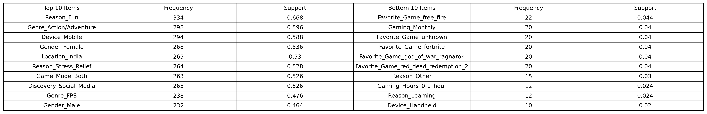
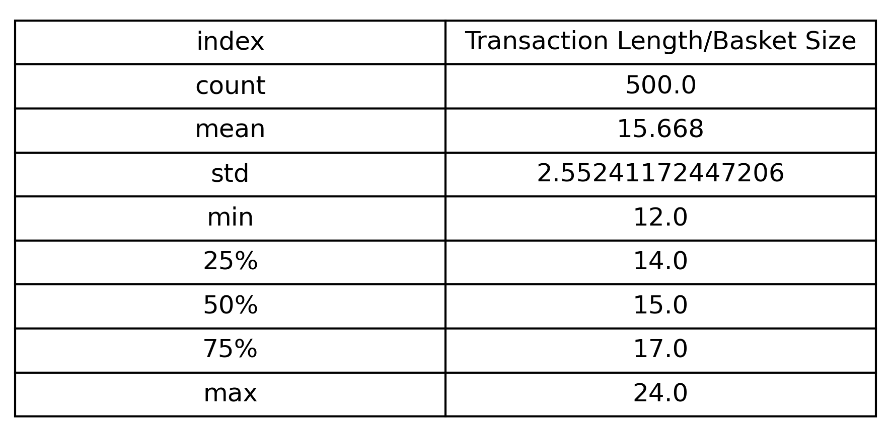

# CSC172 Association Rule Mining Project Progress Report
**Student:** Josiah Raziel S. Lluch, 2022-0834  
**Date:** 12/17/2025  
**Repository:** https://github.com/RazielLluch/CSC172-AssociationMining-Lluch

## 📊 Current Status
| Milestone | Status | Notes |
|-----------|--------|-------|
| Dataset Preparation | ✅ Completed | 500 transactions processed |
| Data Preprocessing | ✅ Completed | One-hot encoded matrix ready |
| EDA & Visualization | ✅ Completed | Item frequencies + basket sizes done |
| Apriori Implementation | ✅ In Progress | Have initial results |
| Rule Evaluation | ⏳ Not Started | Planned for next day |

## 1. Dataset Progress
- **Total transactions:** 500
- **Unique items:** 71 → filtered to 67 (support > 0)
- **Matrix size:** 500 transactions × 67 items (23.385% density)
- **Preprocessing applied:** Missing values removed, one-hot encoding, infrequent item filtering

**Sample transaction preview:**

Transaction 5: ['Age_Young_Adult', 'Location_India', 'Gender_Male', 'Gaming_Weekly', 'Gaming_Hours_1-5_hours', 'Device_Mobile', 'Genre_Sports', 'Favorite_Game_efootball', 'Discovery_Social_Media', 'Game_Mode_Both', 'Spend_lt100', 'Reason_Fun']

Transaction 255: ['Age_Mid_Adult', 'Location_US', 'Gender_Male', 'Gaming_Rarely_Never', 'Gaming_Hours_1-5_hours', 'Device_PC', 'Device_Console', 'Genre_Action/Adventure', 'Genre_MMO', 'Favorite_Game_moba_legends', 'Discovery_Friends_Family', 'Game_Mode_Both', 'Spend_1000plus', 'Reason_Fun', 'Reason_Skills_Competition', 'Reason_Socialize']

## 2. EDA Progress

**Key Findings (so far):**

- Top 5 items: Reason_Fun(66.8%), Genre_Action/Adventure(59.6%), Device_Mobile(58.8%)
- Average basket size: 15.668 items
- 75% transactions contain 17 items or fewer

**Current Metrics:**
| Metric | Value |
|--------|-------|
| Transactions cleaned | 500/500 (100%) |
| Sparsity reduced | 77.932% → 76.6149% |
| Top item support | Reason_Fun: 66.8% |

## 3. Challenges Encountered & Solutions
| Issue | Status | Resolution |
|-------|--------|------------|
| Zero Frequency Items | ✅ Done | Dropped Columns with 0 items(they were not present in the original dataset) |
| Mutually Exclusive Sets of Items(Gender, Age, Income, etc.) | ⏳ Ongoing | Define columns that are mutually exclusive |
| Drop infrequent items |❌ To-do | prune infrequent items within independent column sets based on support |

## 4. Next Steps (Before Final Submission)
- [ ] Complete co-occurrence heatmap
- [ ] Run initial Apriori (min_support=0.02)
- [ ] Generate top 25 rules with metrics
- [ ] Create rule scatter plot 
- [ ] Record 5-min demo video
- [ ] Write complete README.md 